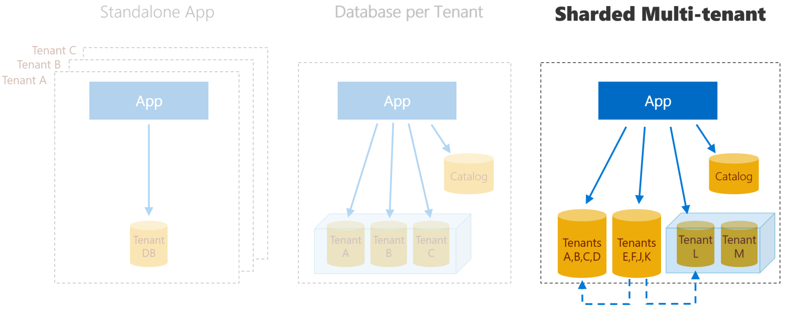

## Wingtip Tickets SaaS - Multi-Tenant Database
Sample multi-tenant SaaS application and management scripts built on SQL Database using a sharded multi-tenant database model. This is one of three versions of the application available that differ in the tenancy model used in the database layer. 



Looking for one of the other SaaS app patterns? Learn more about the [Standalone application](https://github.com/Microsoft/WingtipTicketsSaaS-StandaloneApp) and [Database per tenant](https://github.com/Microsoft/WingtipTicketsSaaS-DbPerTenant) versions.

### Wingtip Tickets SaaS app

The Wingtip Tickets app is a simple event listing and ticketing SaaS app, where each venue is a tenant with events, ticket prices, customers, and ticket sales. The app, together with the management scripts and tutorials, showcases an end-to-end SaaS scenario. This includes provisioning tenants, monitoring and managing performance, schema management and cross-tenant reporting and analytics, all at scale. This application is functionally identical across all three versions.

### Sharded multi-tenant SaaS pattern

The sharded multi-tenant database model used in this sample enables tenant data to be distributed across sharded databases which can each contain any number of tenants. This sample explores the potential to use a mix of databases with many tenants and databases with only a single tenant. Databases containing large numbers of tenants are configured as stand-alone databases with the appropriate performance level (DTUs) for their aggregate workload. While databases with only a single tenant can be standalone databases or hosted in elastic pools where the elastic pool is assigned the appropriate eDTU level for the aggregate workload of all the databases in the pool.

Using this mixed approach, databases with many tenants can be used to host less active tenants, while databases with a single tenant can be used to host more frequently used databases, or databases that need greater isolation and potentially individual management.  This management flexibility is achieved without needing to change the application.  In general, multi-tenant databases can have the lowest per-tenant cost, traded off against lower levels of tenant isolation.  Multi-tenant databases might be used to host tenants that are trialing a service, perhaps at no or little charge, while databases with a single tenant might host tenants on paying plans or those paying a premium price.  Tenants in their own database benefit from greater database isolation, enabling improved security, better performance isolation that allows per-tenant performance monitoring and management, including the option to use elastic database pools to share resources across a group or databases.    

An additional catalog database holds the mapping between tenants and their databases, regardless of number of tenants per database.  This mapping is managed using the Shard Map Management features of the Elastic Scale Client Library.

## Get started

The basic application when installed includes three pre-defined venues in a single multi-tenant database.  The application is installed in your Azure subscription under a single ARM resource group.  To uninstall the application, delete the resource group from the Azure Portal.

Management scripts are provided to allow you to explore many management scenarios, including adding tenants and moving tenants into isolated databases.

NOTE: if you install the application you will be charged for the Azure resources created.  Actual costs incurred are based on your subscription offer type but are nominal if the application is not scaled up unreasonably and is deleted promptly after you have finished exploring the tutorials.

More information about the sample app can be found in the [associated tutorials]() (available shortly).

Also available in the Documentation folder in this repo is an **overview presentation** that provides background, explores alternative database models for multi-tenant apps, and walks through several of the SaaS patterns at a high level. There is also a demo script you can use with the presentation to give others a guided tour of the app and several of the patterns.

To deploy the app to Azure, click the link below.  Deploy the app in a new resource group, and provide a short *user* value that will be appended to several resource names to make them globally unique.  Your initials and a number is a good pattern to use.


<a href="https://aka.ms/deploywingtipmt" target="_blank">
    
</a>


After deployment completes, launch the app by browsing to ```http://events.wtp-mt.USER.trafficmanager.net```, substituting *USER* with the value you set during deployment.

**IMPORTANT:** If you download and extract the repo or [Learning Modules](https://github.com/Microsoft/WingtipSaaS-MT/tree/master/Learning%20Modules) from a zip file, make sure you unblock the .zip file before extracting. Executable contents (scripts, dlls) may be blocked by Windows when zip files are downloaded from an external source and extracted.

To avoid scripts from being blocked by Windows:

1. Right click the zip file and select **Properties**.
1. On the **General** tab, select **Unblock** and select **OK**.


## License
Microsoft Wingtip SaaS sample application and tutorials are licensed under the MIT license. See the [LICENSE](https://github.com/Microsoft/WingtipSaaS-MT/blob/master/license) file for more details.

# Contributing

This project has adopted the [Microsoft Open Source Code of Conduct](https://opensource.microsoft.com/codeofconduct/). For more information see the [Code of Conduct FAQ](https://opensource.microsoft.com/codeofconduct/faq/) or contact [opencode@microsoft.com](mailto:opencode@microsoft.com) with any additional questions or comments.
